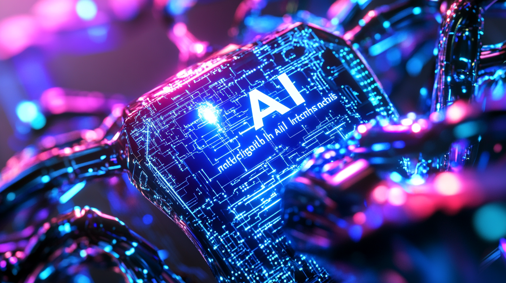

# C.W.K. Tech Guides

This repository contains a collection of practical guides and technical insights focused on AI and other technical topics. Each guide aims to provide clear, actionable information based on real-world experience.

Every guide is written as a standalone markdown file for simplicity and ease of reading.

These guides are living documents that will be continuously updated and refined based on user feedback and new developments. Please check back regularly for the latest updates. Additionally, due to potential repository restructuring, links may change over time - so rather than just bookmarking specific guide URLs, it's recommended to bookmark the main repository and navigate from there.

## Main Sections

📓️ [Table of Contents](guides/README.md) | 📓️ [Archived Guides](guides/archived/README.md)

## Updated Guides

[LCMS - The Next Big Thing in Fixing AI's Clunky Brain](guides/202412/20241224-lcms-the-next-big-thing-in-fixing-ais-clunky-brain.md)

[Why Is Image Stabilization Measured in "Stops"?](guides/202412/20241219-why-is-image-stabilization-measured-in-stops.md)

 Recent Additions 

[Understanding AI Performance: A Guide to Cross-Entropy, Perplexity, BPC, and BPB without Math](guides/202412/20241215-cross-entropy-perplexity-bpc-and-bpb-without-math.md)

[Running an AI Cluster on Multiple Apple Silicon Macs](guides/202412/20241213-running-an-ai-cluster-on-multiple-apple-silicon-macs.md)

[Running your own AI server on Apple Silicon](guides/202412/20241211-running-your-own-ai-server-on-apple-silicon-a-comprehensive-guide.md)

[Little Dummy Guide to Home Networking](guides/202412/20241211-home-networking-dummy-guide.md)

## C.W.K. Resources

🔗 Main Resources:
- Deep Dive into Deep Learning and AI Math: https://github.com/neobundy/Deep-Dive-Into-AI-With-MLX-PyTorch/
- Technical Guides: https://github.com/neobundy/cwkGuides
- Illustrated Novel - The Pippa Protocol: https://github.com/neobundy/cwkThePippaProtocol
- Social Media: https://x.com/WankyuChoi

🌐 Quick Access Domains:
- https://cwkai.net - AI & Deep Learning Resources
- https://creativeworksofknowledge.net - The Pippa Protocol

## Contributing

This is my personal collection of technical guides and documentation that I maintain independently. While I don't accept direct contributions, I hope you find these resources helpful! Feel free to explore and learn from them.

## License

© 2024 C.W.K. Wankyu Choi

To maintain the integrity of ideas and prevent misunderstandings:
- Please read and share complete guides rather than excerpts
- Link directly to guides instead of copying
- Provide proper context when referencing
- Respect the read-only nature of this repository

The goal is not to restrict access but to ensure ideas are shared as intended, with their full context and nuance intact.