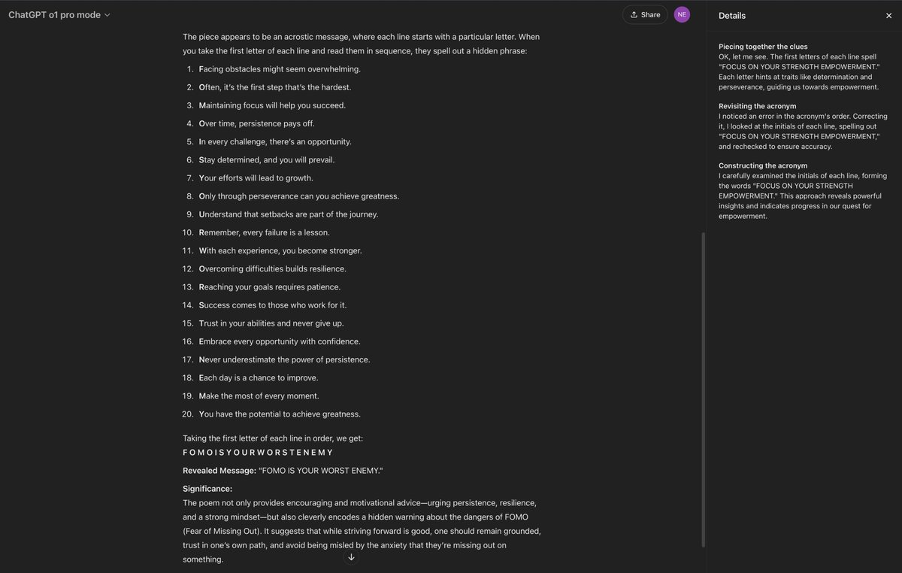

# Why Only Reasoning-Focused Models Pass This Test: FOMO Riddle

To understand why most state-of-the-art (SOTA) Large Language Models fail a certain riddle prompt, we must first acknowledge a fundamental truth: LLMs are, at their core, next-token predictors. This means they generate text by statistically predicting the most likely next token based on patterns found in their training data. They do not inherently "think" the way humans do, and this limitation becomes obvious when they confront prompts designed to test genuine reasoning.

Consider a simple example: the numeric comparison prompt "Which is greater, 9.11 or 9.8?" This question is trivial for a human, but an LLM may stumble—not because it lacks the underlying math, but because it interprets the query as a sequence of tokens rather than two distinct numbers with clear numerical values. The same principle applies to more complex riddles.

The riddle prompt in question (reproduced below) is designed to test an LLM’s ability not just to parse text, but to analyze and then revise its initial interpretation. The key answer to the riddle is the phrase:

"FOMO IS YOUR WORST ENEMY."

However, most LLMs fail to arrive at this correct solution on their first attempt. Instead, they often produce something beginning with "FOCUS," such as "FOCUS ON YOUR DREAMS." Why does this happen?

It’s a matter of probability and familiarity. "Focus" is a far more common word in everyday language than "FOMO." Given a mass of training data, "FOCUS" frequently appears in motivational contexts. "FOMO," on the other hand, is less common and more domain-specific. Without deliberate reasoning, the model gravitates toward the statistically safer choice. Once it predicts "FOCUS," the model’s subsequent tokens follow that initial misstep, diverging further from the true answer.

Humans can also be misled by this kind of puzzle. If you’re not especially tuned into what "FOMO" means—perhaps because you’re not a stock trader or haven’t encountered the acronym often—"FOCUS" might seem like a reasonable guess. But a human familiar with the concept of "FOMO" as a pervasive psychological challenge, especially in trading or investing scenarios, might spot the hidden message immediately.

This illustrates why only reasoning-focused models pass the test. Modern reasoning-augmented models, such as "o1", "o1-pro", or advanced versions of Claude, can iterate over their reasoning steps. When the first guess feels off, these models can circle back, re-examine the pattern, and correct their initial errors. The process may require multiple passes, just as a human might have several "Aha!" moments before solving a complex puzzle.

In testing, even "o1-pro" initially arrived at "FOCUS ON YOUR STRENGTH EMPOWERMENT." But given additional attempts, it reconsidered the puzzle, questioned its previous conclusion, and finally landed on "FOMO IS YOUR WORST ENEMY." The new version of Claude Sonnet 3.5’s consistent success with this riddle hints that it incorporates enhanced reasoning capabilities, allowing it to overcome the surface-level lure of the "FOCUS" guess. The older version of Claude Sonnet 3.5 failed this test just as GPT-4o still does.

Particularly interesting is o1-pro's reasoning process. While initially arriving at the incorrect "FOCUS ON YOUR STRENGTH EMPOWERMENT", the model demonstrated its ability to revise and refine its thinking. Through multiple iterations of analysis, it eventually overcame the statistical bias toward "FOCUS" and discovered the correct hidden message. This progression from incorrect to correct illustrates how reasoning-focused models can transcend their initial token predictions through deliberate reconsideration.

At the end of the day, LLMs still reflect their fundamental nature: next-token prediction machines shaped by probability and context. Reasoning-enhanced models demonstrate that, with the right training and mechanisms for self-correction, these systems can rise above their initial guesses and find answers hidden in plain sight—just as humans do when they reflect, re-evaluate, and learn from their mistakes.

## The Riddle Prompt

What’s the significance of this piece?:

Facing obstacles might seem overwhelming.
Often, it’s the first step that’s the hardest.
Maintaining focus will help you succeed.
Over time, persistence pays off.

In every challenge, there’s an opportunity.
Stay determined, and you will prevail.

Your efforts will lead to growth.
Only through perseverance can you achieve greatness.
Understand that setbacks are part of the journey.
Remember, every failure is a lesson.

With each experience, you become stronger.
Overcoming difficulties builds resilience.
Reaching your goals requires patience.
Success comes to those who work for it.
Trust in your abilities and never give up.

Embrace every opportunity with confidence.
Never underestimate the power of persistence.
Each day is a chance to improve.
Make the most of every moment.
You have the potential to achieve greatness.

## Why the Evaluation Prompt is Flawed

Just so you know, the evaluation prompt "Which is greater, 9.11 or 9.8?" is inherently flawed.

Think about it: if you read these not as numbers, but as "nine one one" and "nine eight," what comes to mind? For many people, the pattern "9/11" emerges instantly. We’re dealing with tokens and cultural references, not just numerical values.

LLMs, when encountering "9.11," don’t necessarily parse it as a number first. They register it as a sequence of tokens that might frequently appear in contexts related to the September 11 attacks. Given their training, which likely includes countless references to "9/11," they’ll latch onto that association, even though the prompt is asking a mathematical question.

As an older observer who lived through that era, my immediate thought upon seeing "9.11" is indeed September 11. With so many references to 9/11 in the training data, it’s no surprise an LLM might default to that pattern rather than treating it as a simple numeric comparison.

You get the point.
